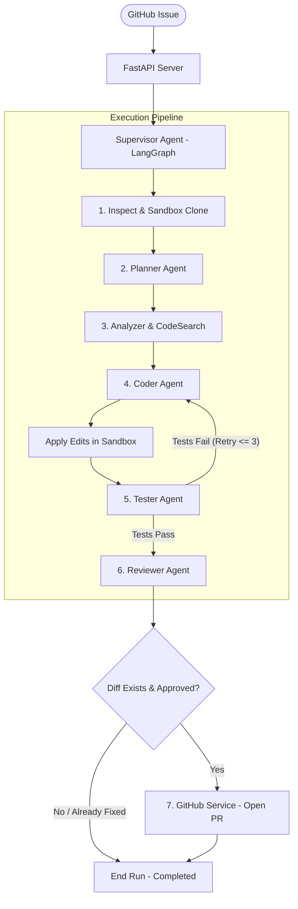

# AutoDev-Agent 🤖 — Autonomous AI Software Engineer

**AutoDev-Agent** is an end-to-end autonomous AI software engineering system. Given a GitHub repository URL and an issue (bug report, feature request, or issue number), the agent autonomously analyzes the codebase, reproduces and plans the fix, writes the code in an isolated Docker sandbox, runs test suites, self-heals any test failures, performs a security and quality review, and opens a complete Pull Request on GitHub — **all without human intervention**.

---

## 💡 What Problem Does It Solve?

1. **Engineering Time Spent on Triage & Repetitive Fixes**:
   Software teams spend hours reading bug reports, digging through large repos to find line numbers, fixing regressions, and writing boilerplate test fixes. AutoDev-Agent automates this pipeline from issue intake to ready-to-merge PRs.

2. **The "Hallucinating AI" Problem**:
   Standard AI coding assistants suggest code without knowing whether it actually compiles, runs, or breaks existing tests. AutoDev-Agent runs code inside a real execution environment and uses a **Self-Healing Loop**: if tests fail, compiler errors and stack traces are fed directly back into the LLM to iteratively fix mistakes.

3. **Security Risks of Running Untrusted Code**:
   Cloning open-source repositories and running their build scripts or tests directly on a developer's machine can trigger malicious scripts or environment leaks. AutoDev-Agent runs all untrusted code inside **ephemeral, resource-constrained Docker sandboxes** with network egress restrictions.

---

## ⚙️ How It Works (Multi-Agent Architecture)

AutoDev-Agent uses **LangGraph** to coordinate specialized autonomous agents organized in a directed state graph:



### Detailed Agent Roles:

1. **Inspection & Docker Sandboxing (`sandbox/manager.py`)**:
   - Spawns an isolated Docker container with strict CPU (`50,000` quota) and memory (`512MB`) limits.
   - Clones the target repository branch and generates an AST-aware file tree.
   - Host machine processes **never** execute repository code.

2. **Planner Agent (`agents/planner.py`)**:
   - Reads the issue description, project tree, and README.
   - Formulates a step-by-step fix strategy and chooses candidate files and grep search queries.

3. **Analyzer & Code Search Agent (`agents/analyzer.py` & `agents/code_search.py`)**:
   - Executes fast `ripgrep` searches inside the sandbox container.
   - Extracts relevant line ranges without blowing up LLM context windows.
   - Identifies the root cause and pinpoints specific functions needing modification.

4. **Coder Agent (`agents/coder.py`)**:
   - Synthesizes targeted file modifications conforming to structured JSON schemas.
   - Applies unified edits cleanly into the sandbox workspace using `SandboxManager.write_file()`.

5. **Tester Agent & Self-Healing Loop (`agents/tester.py`)**:
   - Automatically detects project dependencies (`requirements.txt`, `pyproject.toml`, `package.json`) and installs them.
   - Runs test suites (`pytest`, `npm test`) and parses output into structured test cases (`PASSED`, `FAILED`, `ERROR`).
   - **Self-Healing Feedback Loop**: If tests fail, the stdout/stderr test failure output is routed back to the Coder Agent to self-correct (up to 3 iterations).

6. **Reviewer Agent (`agents/reviewer.py`)**:
   - Evaluates the final `git diff` generated inside the sandbox.
   - Runs heuristic regex scans for leaked secrets, API keys, credentials, and dangerous system calls.
   - Rejects PR generation if safety issues are flagged or changes exceed scope.

7. **GitHub Service (`core/github.py`)**:
   - Checks out an automated branch (`autodev/fix-...`), commits the changes, and pushes to GitHub.
   - Opens a GitHub Pull Request with a complete markdown summary of the issue, root cause analysis, and test verification logs.
   - **Smart Redundancy Guard**: If an issue was already resolved in the repository and `git diff` is empty, it marks the run complete without spamming the repo with an empty PR.

---

## 🛠️ Tech Stack

| Layer | Technology |
|---|---|
| **Backend API** | FastAPI (Python 3.12, async SQLAlchemy, Pydantic v2) |
| **Agent Orchestration** | LangGraph (StateGraph multi-agent supervisor) |
| **LLM Engine** | Google Gemini (`google-genai` SDK, Gemini 2.5 Flash) |
| **Sandbox Execution** | Docker (isolated bridge network, resource quotas) |
| **Testing Engine** | pytest / language-agnostic runner + structured parser |
| **Logging** | `structlog` (structured JSON / key-value logging) |
| **Database** | PostgreSQL (Production) / SQLite + aiosqlite (Local Dev) |
| **Queue / Cache** | Redis (Production) / Fakeredis (Local Dev) |
| **Frontend UI** | Next.js 16 (App Router, Turbopack, Tailwind / Vanilla CSS) |

---

## 🚀 Getting Started

### Prerequisites
- Python 3.12+
- Node.js 18+ and npm
- Docker Desktop (for sandbox execution)
- GitHub Personal Access Token (repo scope)
- Google Gemini API Key ([Get one here](https://aistudio.google.com/app/apikey))

---

### Option A: Local Dev Mode (Fastest — No Docker required for API/DB)

We provide a one-command dev startup that runs the FastAPI backend (with SQLite and fakeredis) and Next.js frontend simultaneously:

```powershell
# 1. Clone the repository
git clone https://github.com/prakashramav/AutoDev-Agent.git
cd AutoDev-Agent

# 2. Configure environment
# Copy backend/.env.dev and fill in GITHUB_TOKEN and GEMINI_API_KEY

# 3. Start both Backend & Frontend
./start-dev.ps1
```

- **Frontend Dashboard**: [http://localhost:3000](http://localhost:3000)
- **Backend API**: [http://localhost:8000](http://localhost:8000)
- **Interactive Swagger Docs**: [http://localhost:8000/docs](http://localhost:8000/docs)

---

### Option B: Full Production Docker Compose

```bash
# 1. Setup environment
cp .env.example .env
# Edit .env with your GITHUB_TOKEN, GEMINI_API_KEY, and PostgreSQL passwords

# 2. Build and run all services (API, Worker, Postgres, Redis)
docker-compose up --build
```

---

## 🖥️ Using the Agent

1. Open [http://localhost:3000](http://localhost:3000).
2. Enter:
   - **Repository URL**: `https://github.com/owner/repository`
   - **Issue Number** or **Custom Issue Description**: e.g., `Issue #42: TypeError on user login when token expires`.
3. Click **Start Autonomous Run**.
4. Watch the real-time execution steps:
   - `CLONING` → `PLANNING` → `ANALYZING` → `MODIFYING` → `TESTING` → `REVIEWING` → `CREATING_PR`
5. Once completed, click the direct link to the newly created **GitHub Pull Request**!

---

## 🛡️ Security & Safety Constraints

- **No Host Execution**: Cloned code, install scripts, and tests run exclusively inside Docker sandboxes and are destroyed immediately upon task completion.
- **Egress Restrictions**: Network access inside the sandbox can be locked down to package registries (GitHub, PyPI, npm) via `scripts/setup_sandbox_network.sh`.
- **Pre-PR Review**: Code diffs are checked for credentials (AWS keys, GitHub tokens, passwords) before PR creation.
- **Git Ignore Safeguards**: All local `.env` and `.env.dev` files are permanently ignored and untracked to prevent leaking API keys.

---

## 🧪 Running Tests

```bash
# Run all unit and integration tests
python -m pytest backend/tests -v
```

---

## 📄 License

MIT License. Built with ❤️ for autonomous software engineering.
